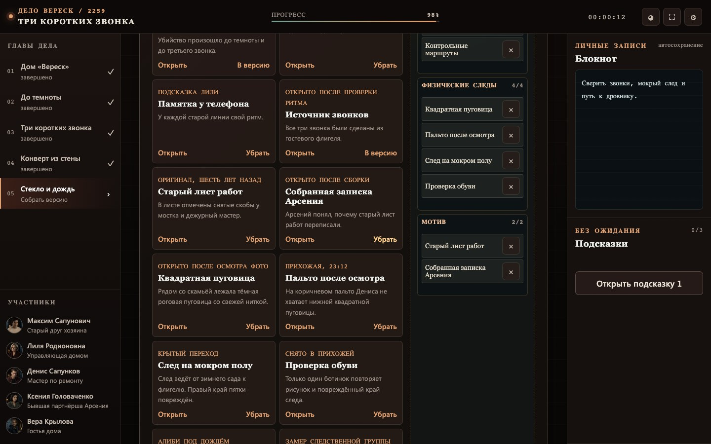

# Три коротких звонка

«Три коротких звонка» — русскоязычная браузерная детективная игра об убийстве в загородном доме «Вереск». Дождь отрезал дом от дороги, внутри остались пять гостей, и один из них лжёт о своём пути. Игра рассчитана на 1–6 следователей за одним экраном и занимает примерно 35–50 минут.

[Играть на GitHub Pages](https://justdosmile.github.io/midnight-protocol-detective/) · [Репозиторий](https://github.com/justdosmile/midnight-protocol-detective)


Все герои и события вымышлены. Жестоких сцен нет. README намеренно не раскрывает решение.

## Что внутри

- 5 глав и 5 подозреваемых;
- 38 коротких материалов дела;
- восстановление порядка событий;
- поиск телефона по ритму звонков;
- сборка обгоревшей записки;
- осмотр фотографии зимнего сада;
- доска следствия с пятью цепочками доказательств;
- блокнот, фильтры улик и трёхуровневые подсказки;
- локальная атмосферная фоновая музыка;
- полностью локальная игра без внешних запросов после загрузки.



## Как играть

Открывайте материалы главы, сравнивайте показания и записывайте версии в блокнот. Все задачи можно пройти мышью, касанием или клавиатурой. Перетаскивание имеет кнопочную альтернативу. Важные звуки всегда показаны точками и обычным текстом.

Материалы открываются в отдельном окне с собственной прокруткой. В настройках доступны крупный текст, повышенный контраст, уменьшение анимации и регулировка музыки.

## Сохранение

Прогресс, заметки и настройки автоматически сохраняются в `localStorage` текущего браузера под ключом `three-short-rings:save`. После перезагрузки выберите «Продолжить расследование».

Сохранение не переносится между устройствами. Сброс прогресса требует отдельного подтверждения.

## Изображения и звук

Все содержательные изображения созданы специально для проекта встроенным GPT Image и опубликованы как WebP. SVG-иллюстраций, внешних картинок и узнаваемых образов существующих хоррор-франшиз в игре нет. Подробный перечень находится в [манифесте ассетов](public/assets/ASSET_MANIFEST.md).

Фоновая музыка хранится локально и играет на половине исходной громкости. Короткие сигналы интерфейса создаются Web Audio API. Звук включается после действия игрока, поэтому браузер не блокирует воспроизведение. Игра остаётся полностью проходимой с выключенной музыкой.

## Локальный запуск

Понадобится Node.js 20.19 или новее.

```bash
git clone https://github.com/justdosmile/midnight-protocol-detective.git
cd midnight-protocol-detective
npm ci
npm run dev
```

Основные проверки:

```bash
npm run lint
npm run typecheck
npm run test
npm run build
npm run test:e2e:prod
```

Для браузерных тестов нужен Chromium от Playwright: `npx playwright install chromium`.

## Публикация

Проект полностью статический. Workflow в `.github/workflows/` проверяет код, проходит игру в Chromium, собирает `dist/` и публикует его на GitHub Pages.

## Стек

- React 19, TypeScript 5.8 и Vite 7;
- CSS без UI-фреймворка;
- Web Audio API, Web Crypto API и `localStorage`;
- Vitest, Playwright и ESLint.

## Лицензия

[MIT](LICENSE)
