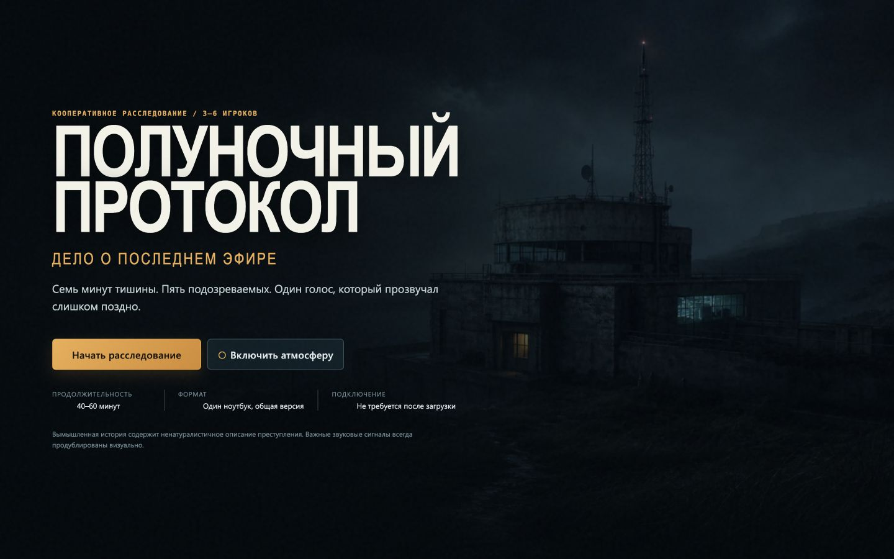

# Полуночный протокол

«Полуночный протокол» — атмосферная русскоязычная браузерная игра о расследовании последнего эфира на изолированной радиостанции. Она рассчитана на 3–6 игроков за одним экраном, занимает 40–60 минут и не требует подключения к сети после загрузки.

[Играть на GitHub Pages](https://justdosmile.github.io/midnight-protocol-detective/) · [Репозиторий](https://github.com/justdosmile/midnight-protocol-detective)



## Что внутри

- 5 последовательно открывающихся глав;
- 5 подозреваемых с отдельными карточками;
- 39 материалов дела: документы, записи, фотографии и журналы;
- 5 разных головоломок;
- блокнот с автосохранением, отметки важных улик и фильтры;
- трёхуровневые подсказки, которые не блокируют финал;
- полностью локальный игровой процесс без сервера и внешних runtime-запросов.

История вымышленная и содержит ненатуралистичное описание преступления. README намеренно не раскрывает решение.

## Управление

- Открывайте главы, материалы и карточки подозреваемых нажатием мыши или касанием.
- Решайте задачи с помощью кнопок, полей ввода, ползунков и фильтров. Перетаскивание поддерживается, но для него предусмотрены кнопочные альтернативы.
- Для клавиатуры доступны `Tab` и `Shift+Tab` для перехода между элементами, `Enter` или `Space` для активации и `Esc` для закрытия диалогов.
- Блокнот и подсказки находятся в правой панели. Звук, полноэкранный режим и настройки — в верхней панели.

## Сохранение

Прогресс, просмотренные материалы, решения головоломок, заметки и настройки автоматически сохраняются в `localStorage` текущего браузера под ключом `midnight-protocol:save`. После перезагрузки выберите «Продолжить расследование».

Сохранение привязано к браузеру, устройству и адресу сайта и не синхронизируется между ними. «Сбросить расследование» в настройках удаляет игровой прогресс после подтверждения; очистка данных сайта в браузере также удалит сохранение.

## Доступность

- полноценная клавиатурная навигация и заметный индикатор фокуса;
- семантические заголовки, подписи элементов и ARIA-атрибуты;
- удержание фокуса внутри диалогов и возврат к исходному элементу после закрытия;
- режимы крупного текста, повышенного контраста и минимальной анимации;
- поддержка системной настройки `prefers-reduced-motion`;
- важные звуковые сигналы продублированы визуально, а атмосферный звук можно отключить;
- адаптивная раскладка для настольных и планшетных экранов.

## Локальный запуск

Понадобится Node.js 20.19 или новее.

```bash
git clone https://github.com/justdosmile/midnight-protocol-detective.git
cd midnight-protocol-detective
npm ci
npm run dev
```

Vite выведет локальный адрес приложения в терминал.

Основные команды:

```bash
npm run dev        # сервер разработки
npm run build      # production-сборка в dist/
npm run preview    # локальный просмотр production-сборки
npm run lint       # ESLint и проверка исходников
npm run typecheck  # проверка TypeScript
npm run test       # unit-тесты Vitest
npm run test:e2e   # браузерные тесты Playwright
npm run test:e2e:prod # E2E по production-сборке с Pages base path
```

Для `npm run test:e2e` должен быть установлен браузер Playwright. При первом запуске его можно добавить командой `npx playwright install chromium`.

## GitHub Pages

Проект является полностью статическим: `npm run build` создаёт каталог `dist/`, который можно публиковать как артефакт GitHub Pages. Vite настроен на относительный базовый путь, поэтому ресурсы корректно загружаются со страницы проекта:

<https://justdosmile.github.io/midnight-protocol-detective/>

Для проверки собранной версии перед публикацией выполните:

```bash
npm run build
npm run preview
```

## Стек

- React 19 и TypeScript 5.8;
- Vite 7;
- CSS без UI-фреймворка;
- браузерные `localStorage`, Web Audio API и Web Crypto API;
- Vitest, Testing Library и jsdom для unit-тестов;
- Playwright для сквозных браузерных сценариев;
- ESLint для статического анализа.

## Лицензия

[MIT](LICENSE)
